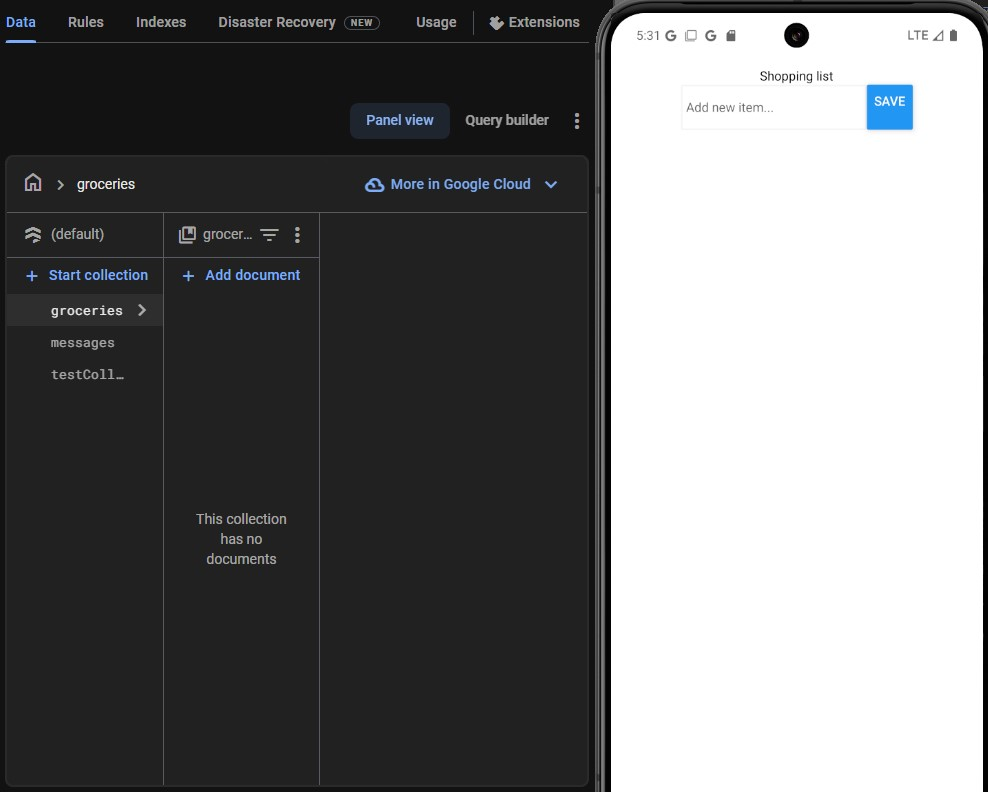
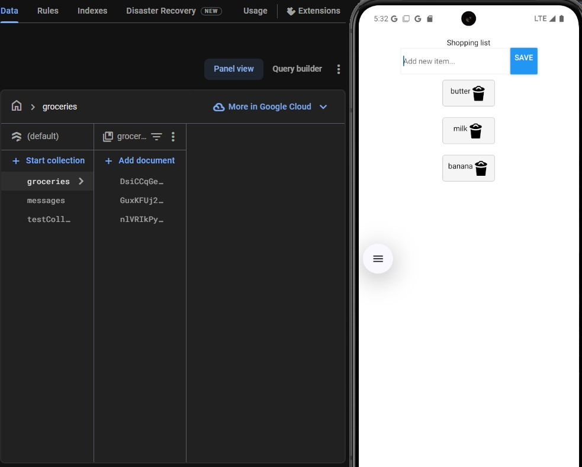

# Task 8

# !NOTE, you need to provide your own API.js file inside firebase folder
example:

```
export const firebaseConfig = {
  apiKey: "...",
  authDomain: "...",
  projectId: "...",
  storageBucket: "...",
  messagingSenderId: "...",
  appId: "..."
};
```




